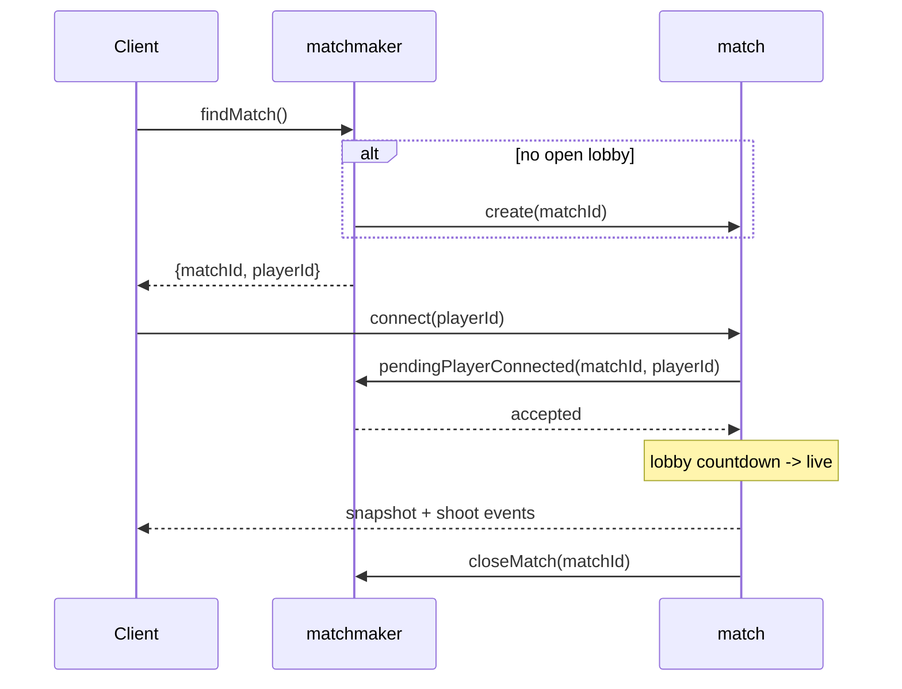
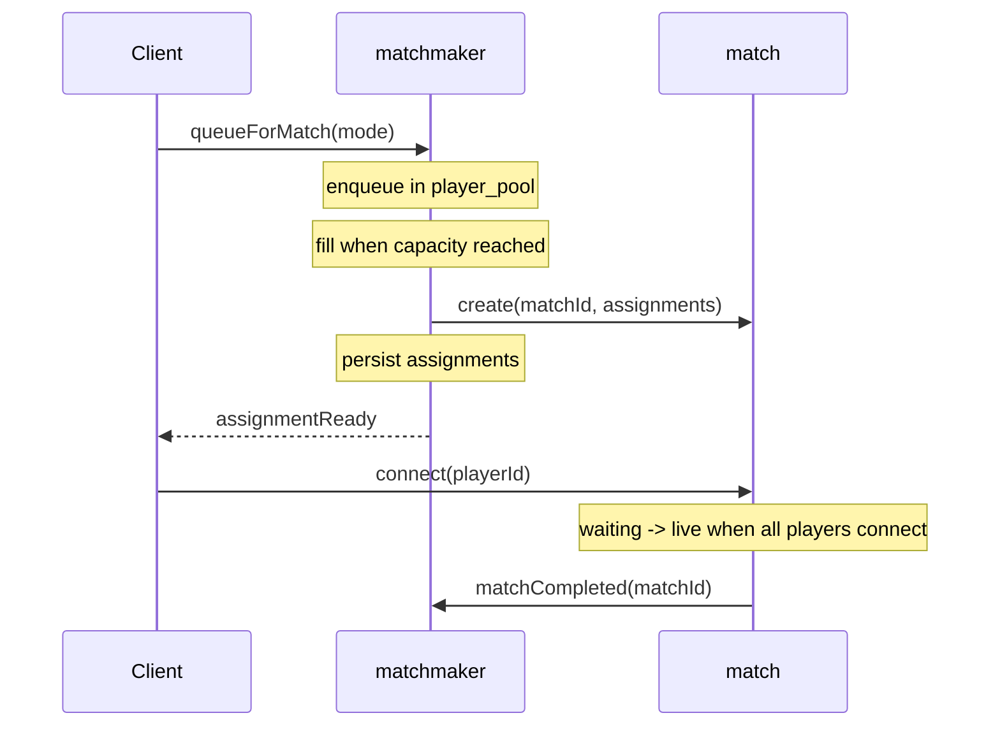
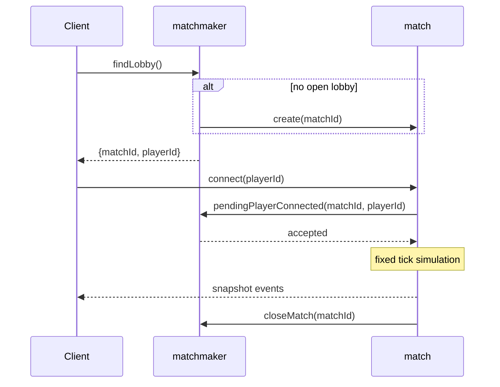
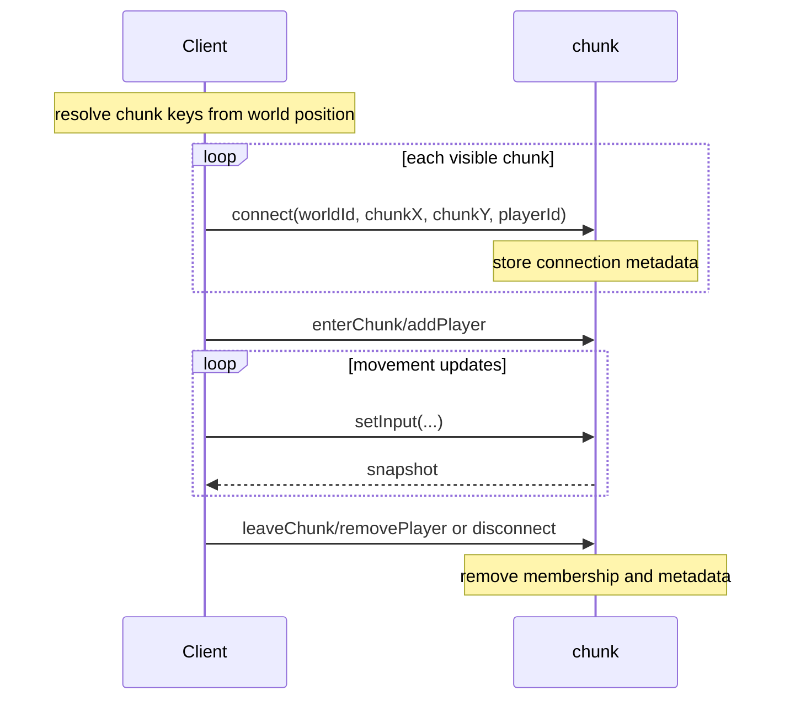
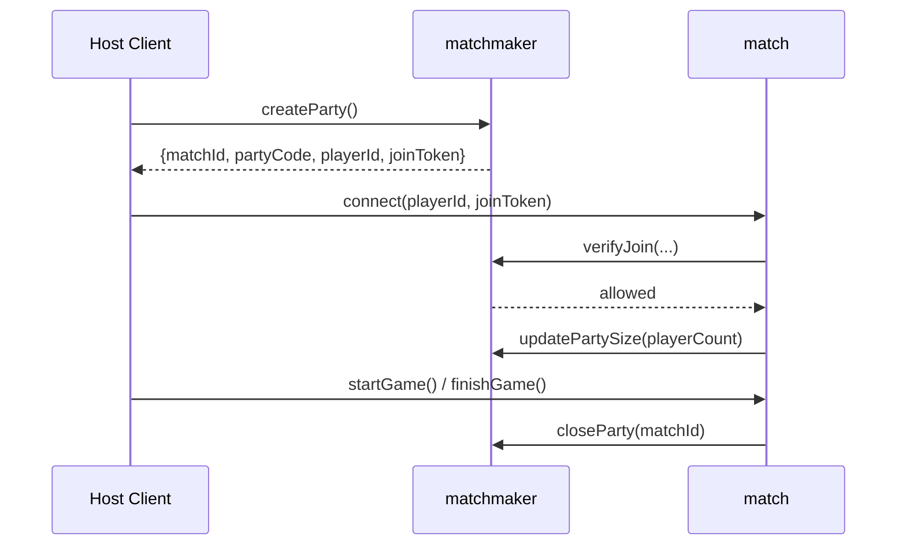
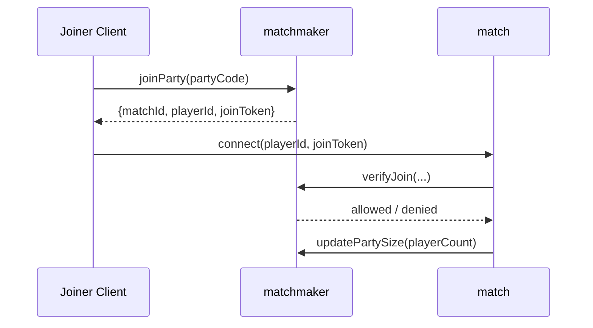
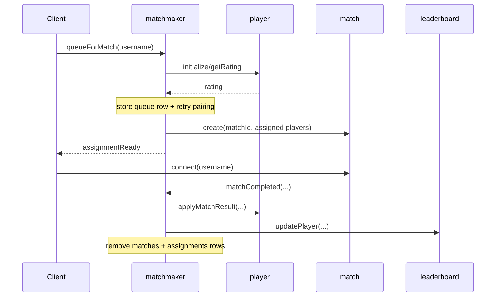
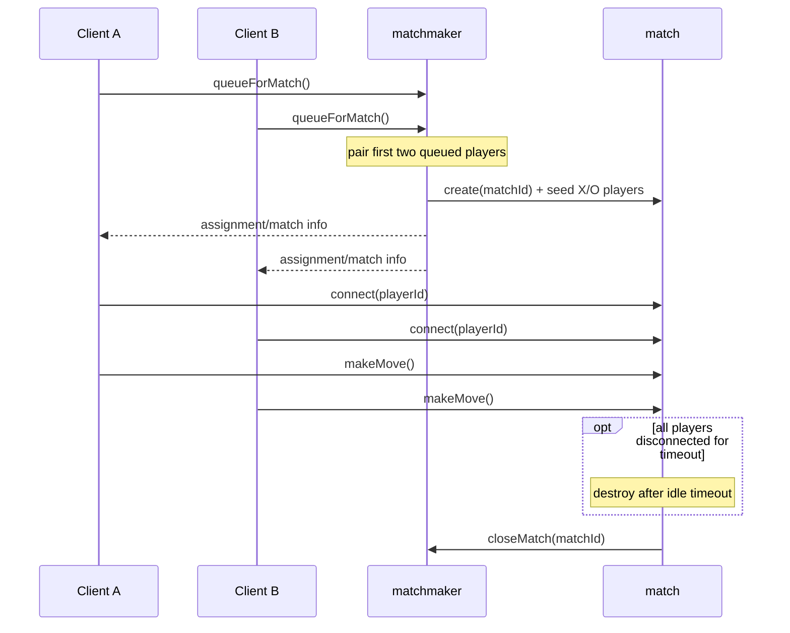
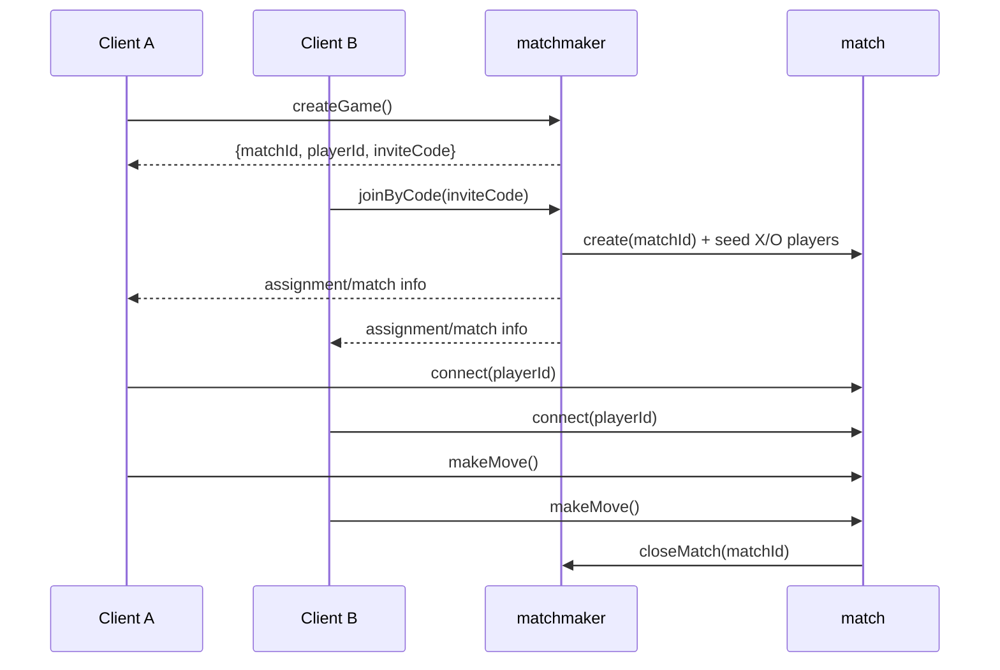
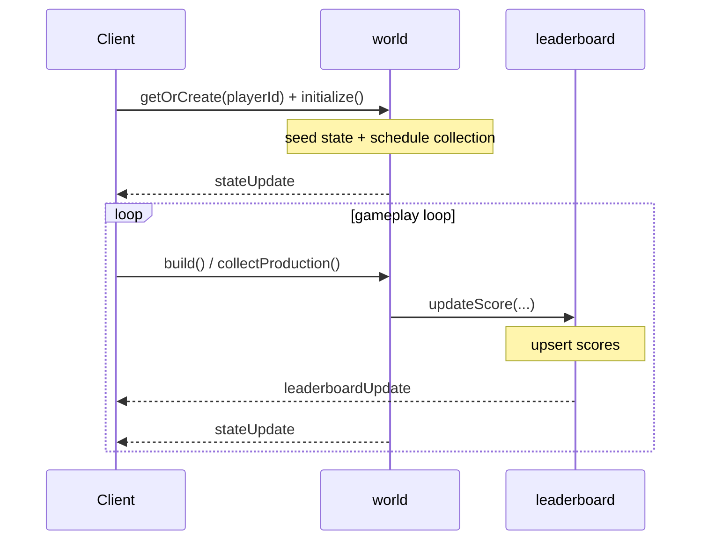

Patterns for building multiplayer games with RivetKit, intended as a practical checklist you can adapt per genre.

## Starter Code

Start with one of the working examples on [GitHub](https://github.com/rivet-dev/rivet/tree/main/examples/multiplayer-game-patterns/src/actors/) and adapt it to your game. Do not start from scratch for matchmaking and lifecycle flows.

| Game Classification | Starter Code | Common Examples |
| --- | --- | --- |
| Battle Royale | [GitHub](https://github.com/rivet-dev/rivet/tree/main/examples/multiplayer-game-patterns/src/actors/battle-royale/) | Fortnite, Apex Legends, PUBG, Warzone |
| Arena | [GitHub](https://github.com/rivet-dev/rivet/tree/main/examples/multiplayer-game-patterns/src/actors/arena/) | Call of Duty TDM/FFA, Halo Slayer, Counter-Strike casual, VALORANT unrated, Overwatch Quick Play, Rocket League |
| IO Style | [GitHub](https://github.com/rivet-dev/rivet/tree/main/examples/multiplayer-game-patterns/src/actors/io-style/) | Agar.io, Slither.io, surviv.io |
| Open World | [GitHub](https://github.com/rivet-dev/rivet/tree/main/examples/multiplayer-game-patterns/src/actors/open-world/) | Minecraft survival servers, Rust-like worlds, MMO zone/chunk worlds |
| Party | [GitHub](https://github.com/rivet-dev/rivet/tree/main/examples/multiplayer-game-patterns/src/actors/party/) | Fall Guys private lobbies, custom game rooms, social party sessions |
| Physics 2D | [GitHub](https://github.com/rivet-dev/rivet/tree/main/examples/multiplayer-game-patterns/src/actors/physics-2d/) | Top-down physics brawlers, 2D arena games, platform fighters |
| Physics 3D | [GitHub](https://github.com/rivet-dev/rivet/tree/main/examples/multiplayer-game-patterns/src/actors/physics-3d/) | Physics sandbox sessions, 3D arena games, movement playgrounds |
| Ranked | [GitHub](https://github.com/rivet-dev/rivet/tree/main/examples/multiplayer-game-patterns/src/actors/ranked/) | Chess ladders, competitive card games, duel arena ranked queues |
| Turn-Based | [GitHub](https://github.com/rivet-dev/rivet/tree/main/examples/multiplayer-game-patterns/src/actors/turn-based/) | Chess correspondence, Words With Friends, async board games |
| Idle | [GitHub](https://github.com/rivet-dev/rivet/tree/main/examples/multiplayer-game-patterns/src/actors/idle/) | Cookie Clicker, Idle Miner Tycoon, Adventure Capitalist |

## Server Simulation

### Game Loop And Tick Rates

| Pattern | Use When | Implementation Guidance |
| --- | --- | --- |
| Fixed realtime loop | Battle Royale, Arena, IO Style, Open World, Ranked | Run in `run` with `sleep(tickMs)` and exit on `c.aborted`. |
| Action-driven updates | Party, Turn-Based | Mutate and broadcast only on actions/events rather than scheduled ticks. |
| Coarse offline progression | Any mode with idle progression | Use `c.schedule.after(...)` with coarse windows (for example 5 to 15 minutes) and apply catch-up from elapsed wall clock time. |

### Physics

Start with custom kinematic logic for simple games. Switch to a full physics engine when you need joints, stacked bodies, high collision density, or complex shapes (rotated polygons, capsules, convex hulls, triangle meshes).

Pick one engine per simulation. Keep frontend-only libs out of backend simulation paths and treat server state as authoritative.

| Dimension | Primary Engine | Fallback Engines | Example Code |
| --- | --- | --- | --- |
| 2D | `@dimforge/rapier2d` | `planck-js`, `matter-js` | [GitHub](https://github.com/rivet-dev/rivet/tree/main/examples/multiplayer-game-patterns/src/actors/physics-2d/) |
| 3D | `@dimforge/rapier3d` | `cannon-es`, `ammo.js` | [GitHub](https://github.com/rivet-dev/rivet/tree/main/examples/multiplayer-game-patterns/src/actors/physics-3d/) |

### Spatial Indexing

For non-physics spatial queries, use a dedicated index instead of naive `O(n^2)` checks:

| Index Type | Recommendation |
| --- | --- |
| AABB index | For AOI, visibility, and non-collider entities, use `rbush` for dynamic sets or `flatbush` for static-ish sets. |
| Point index | For nearest-neighbor or within-radius queries, use `d3-quadtree`. |

## Networking & State Sync

### Netcode

| Model | When To Use | Implementation |
| --- | --- | --- |
| Hybrid (client movement, server combat) | Shooters, action sports, ranked duels | Client owns movement and sends capped-rate position updates. Server validates for anti-cheat. Combat (projectiles, hits, damage) is fully server-authoritative. |
| Server-authoritative with interpolation | IO Style, persistent worlds | Client sends input commands. Server simulates on fixed ticks and publishes authoritative snapshots. Client interpolates between snapshots. |
| Server-authoritative (basic logic) | Turn-based, event-driven | Server validates and applies discrete actions (turns, phase transitions, votes). Client displays confirmed state. |

### Realtime Data Model

- **Snapshots and diffs**: Publish state as events. Send a full snapshot on join/resync, then per-tick diffs for regular updates.
- **Batch per tick**: Keep events small and typed. Batch high-frequency updates per tick.
- **Avoid UI framework state for game updates**: Use `requestAnimationFrame` or a Canvas/Three.js loop for simulation, not React state. Reserve UI framework state for menus, HUD, and forms.
- **Broadcast vs per-connection**: Use `c.broadcast(...)` for shared updates and `conn.send(...)` for private/per-player data.

### Shared Simulation Logic

Shared simulation logic runs on both the client and the server. For example, an `applyInput(state, input, dt)` function that integrates velocity and clamps to world bounds can run on the client for prediction and on the server for validation.

- **Hybrid modes**: Client runs shared movement as primary authority, server runs it for anti-cheat validation.
- **Server-authoritative modes**: Client uses shared logic for interpolation and prediction only.
- **Keep it pure**: Movement integration, input transforms, collision helpers, and constants only.
- **Put shared code in `src/shared/`**: Keep deterministic helpers in `src/shared/sim/*` with no side effects.

### Interest Management

Control what each client receives to reduce bandwidth and prevent information leaks.

#### Per-Player Replication Filters

- **Filter by relevance**: Send each client only state relevant to that player (proximity, line-of-sight, team, or game phase).
- **Shooters and action games**: Limit replication by proximity and optional field-of-view checks.
- **Server-side only**: Clients should never receive data they should not see.

#### Sharded Worlds

- **Partition large worlds**: Use chunk actors keyed by `worldId:chunkX:chunkY`.
- **Subscribe to nearby chunks**: Clients connect only to nearby partitions (for example a 3x3 chunk window).
- **Use sparingly**: Only when the world is large and state-heavy (sandbox builders, MMOs), not as a default for small matches.

## Backend Infrastructure

### Persistence

- **In-memory state**: Best for realtime game state that changes every tick (player positions, inputs, match phase, scores).
- **SQLite (`rivetkit/db`)**: Better for large or table-like state that needs queries, indexes, or long-term persistence (tiles, inventory, matchmaking pools). Serialize DB work through a queue since multiple actions can hit the same actor concurrently.

### Matchmaking Patterns

Common building blocks used across the architecture patterns below.

#### Actor Topology

| Primitive | Use When | Typical Ownership |
| --- | --- | --- |
| `matchmaker["main"]` + `match[matchId]` | Session-based multiplayer (battle royale, arena, ranked, party, turn-based) | Matchmaker owns discovery/assignment. Match owns lifecycle and gameplay state. |
| `chunk[worldId,chunkX,chunkY]` | Large continuous worlds that need sharding | Each chunk owns local players, chunk state, and local simulation. |
| `world[playerId]` | Per-player progression loops (idle/solo world state) | Per-player resources, buildings, timers, and progression. |
| `player[username]` | Canonical profile/rating reused across matches | Durable player stats (for example rating and win/loss). |
| `leaderboard["main"]` | Shared rankings across many matches/players | Global ordered score rows and top lists. |

#### Queueing Strategy

- Multiple players can hit the matchmaker at the same time, so actions like find/create, queue/unqueue, and close need to be serialized through actor queues to avoid races.
- Match-local actions (gameplay, scoring) do not need queueing unless they write back to the matchmaker.

## Security And Anti-Cheat

Start with this baseline, then harden further for competitive or high-risk environments.

### Baseline Checklist

- **Identity**: Use `c.conn.id` as the authoritative transport identity. Treat `playerId`/`username` in params as untrusted input and bind through server-issued assignment/join tickets.
- **Authorization**: Validate the caller is allowed to mutate the target entity (room membership, turn ownership, host-only actions).
- **Input validation**: Clamp sizes/lengths, validate enums, and validate usernames (length, allowed chars, avoid unbounded Unicode).
- **Rate limiting**: Per-connection rate limits for spammy actions (chat, join/leave, fire, movement updates).
- **State integrity**: Server recomputes derived state (scores, win conditions, placements). Never allow client-authoritative changes to inventory/currency/leaderboard totals.

### Movement Validation

For any mode with client-authoritative movement (hybrid flows), clients may send position/rotation updates for smoothness, but the server must:

- Enforce max delta per update (speed cap) based on elapsed time.
- Reject or clamp teleports.
- Enforce world bounds (and basic collision if applicable).
- Rate limit update frequency (for example 20Hz max).

## Architecture Patterns

Each game type below starts with a quick summary table, then details actors and lifecycle.

### Battle Royale

| Topic | Summary |
| --- | --- |
| Matchmaking | Immediate routing to the fullest non-started lobby (oldest tie-break); players wait in lobby until capacity, then the match starts. |
| Netcode | Hybrid. Client owns movement, camera, and local prediction. Server owns zone state, projectiles, hit resolution, eliminations, loot, and final placement. |
| Tick Rate | 10 ticks/sec (`100ms`) with a fixed loop for zone progression and lifecycle checks. |
| Physics | Client owns movement with server anti-cheat validation; projectiles, hits, and damage are server-authoritative. Use `@dimforge/rapier3d` for 3D or `@dimforge/rapier2d` for top-down 2D. |

**Actors**

<AccordionGroup>
<Accordion title='matchmaker["main"]'>

- **Key**: `matchmaker["main"]`
- **Responsibility**: Finds or creates lobbies, tracks pending reservations, and maintains occupancy.
- **Actions**
  - `findMatch`
  - `pendingPlayerConnected`
  - `updateMatch`
  - `closeMatch`
- **Queues**
  - `findMatch`
  - `pendingPlayerConnected`
  - `updateMatch`
  - `closeMatch`
- **State**
  - SQLite
  - `matches`
  - `pending_players`
  - `player_count` includes connected and pending players

</Accordion>
<Accordion title="match[matchId]">

- **Key**: `match[matchId]`
- **Responsibility**: Runs lobby/live/finished phases, owns player state, zone progression, and eliminations.
- **Actions**
  - `connect`
  - Movement and combat actions
- **Queues**
  - None
- **State**
  - JSON
  - `phase`
  - `players`
  - `zone`
  - `eliminations`
  - `snapshot data`

</Accordion>
</AccordionGroup>

**Lifecycle**

### Arena

| Topic | Summary |
| --- | --- |
| Matchmaking | Mode-based fixed-capacity queues (`duo`, `squad`, `ffa`) that build only full matches and pre-assign teams (except FFA). |
| Netcode | Hybrid. Client owns movement plus prediction and smoothing. Server owns team or FFA assignment, projectiles, hit resolution, phase transitions, and scoring. |
| Tick Rate | 20 ticks/sec (`50ms`) with a tighter loop for live team and FFA snapshots. |
| Physics | Medium to high intensity; client movement with server validation and server-authoritative combat/entities. |

**Actors**

<AccordionGroup>
<Accordion title='matchmaker["main"]'>

- **Key**: `matchmaker["main"]`
- **Responsibility**: Runs mode queues, builds full matches, assigns teams, and publishes assignments.
- **Actions**
  - `queueForMatch`
  - `unqueueForMatch`
  - `matchCompleted`
- **Queues**
  - `queueForMatch`
  - `unqueueForMatch`
  - `matchCompleted`
- **State**
  - SQLite
  - `player_pool`
  - `matches`
  - `assignments` keyed by connection and player

</Accordion>
<Accordion title="match[matchId]">

- **Key**: `match[matchId]`
- **Responsibility**: Runs match phases and in-match player/team state for score and win conditions.
- **Actions**
  - `connect`
  - Gameplay actions
- **Queues**
  - None
- **State**
  - JSON
  - `phase`
  - `players`
  - `team assignments`
  - `score and win state`

</Accordion>
</AccordionGroup>

**Lifecycle**

### IO Style

| Topic | Summary |
| --- | --- |
| Matchmaking | Open-lobby routing to the fullest room below capacity; room counts are heartbeated and new lobbies are auto-created when needed. |
| Netcode | Server-authoritative with interpolation. Client sends input intents and interpolates. Server owns movement, bounds, room membership, and canonical snapshots. |
| Tick Rate | 10 ticks/sec (`100ms`) with lightweight periodic room snapshots. |
| Physics | Low to medium intensity; server-authoritative kinematic movement, escalating to a physics engine only when collisions get complex. |

**Actors**

<AccordionGroup>
<Accordion title='matchmaker["main"]'>

- **Key**: `matchmaker["main"]`
- **Responsibility**: Routes players into the fullest open lobby and tracks reservations and occupancy.
- **Actions**
  - `findLobby`
  - `pendingPlayerConnected`
  - `updateMatch`
  - `closeMatch`
- **Queues**
  - `findLobby`
  - `pendingPlayerConnected`
  - `updateMatch`
  - `closeMatch`
- **State**
  - SQLite
  - `matches`
  - `pending_players`
  - Occupancy includes pending reservations

</Accordion>
<Accordion title="match[matchId]">

- **Key**: `match[matchId]`
- **Responsibility**: Runs per-match movement simulation and broadcasts snapshots.
- **Actions**
  - `connect`
  - `setInput`
- **Queues**
  - None
- **State**
  - JSON
  - `players`
  - `inputs`
  - `movement state`
  - `snapshot cache`

</Accordion>
</AccordionGroup>

**Lifecycle**

### Open World

| Topic | Summary |
| --- | --- |
| Matchmaking | Client-driven chunk routing from world coordinates, with nearby chunk windows preloaded via adjacent chunk connections. |
| Netcode | Hybrid for sandbox (client movement with validation) or server-authoritative for MMO-like flows. Server owns chunk routing, persistence, and canonical world state. |
| Tick Rate | 10 ticks/sec per chunk actor (`100ms`), so load scales with active chunks. |
| Physics | Medium to high at scale; chunk-local simulation can be server-authoritative (MMO-like) or client movement with server validation (sandbox-like). |

**Actors**

<AccordionGroup>
<Accordion title="chunk[worldId,chunkX,chunkY]">

- **Key**: `chunk[worldId,chunkX,chunkY]`
- **Responsibility**: Owns chunk-local players, blocks, movement tick, and chunk membership.
- **Actions**
  - `connect`
  - `enterChunk`
  - `addPlayer`
  - `setInput`
  - `leaveChunk`
  - `removePlayer`
- **Queues**
  - None
- **State**
  - JSON
  - `connections`
  - `players`
  - `blocks` scoped to one chunk key

</Accordion>
</AccordionGroup>

**Lifecycle**

### Party

| Topic | Summary |
| --- | --- |
| Matchmaking | Host-created private party flow using party codes and explicit joins. |
| Netcode | Server-authoritative (basic logic). Server owns membership, host permissions, and phase transitions. |
| Tick Rate | No continuous tick; updates are event-driven (`join`, `start`, `finish`). |
| Physics | Low intensity for lobby-first flows; usually no dedicated physics or indexing unless you add realtime mini-games. |

**Actors**

<AccordionGroup>
<Accordion title='matchmaker["main"]'>

- **Key**: `matchmaker["main"]`
- **Responsibility**: Handles party create/join flow, validates join tickets, and tracks party size.
- **Actions**
  - `createParty`
  - `joinParty`
  - `verifyJoin`
  - `updatePartySize`
  - `closeParty`
- **Queues**
  - `createParty`
  - `joinParty`
  - `verifyJoin`
  - `updatePartySize`
  - `closeParty`
- **State**
  - SQLite
  - `parties`
  - `join_tickets` for party lookup and join validation

</Accordion>
<Accordion title="match[matchId]">

- **Key**: `match[matchId]`
- **Responsibility**: Owns party members, host role, ready flags, and phase transitions.
- **Actions**
  - `connect`
  - `startGame`
  - `finishGame`
- **Queues**
  - None
- **State**
  - JSON
  - `members`
  - `host`
  - `ready state`
  - `phase`
  - `party events`

</Accordion>
</AccordionGroup>

**Lifecycle**

<Tabs>
<Tab title="Host Flow">

</Tab>
<Tab title="Joiner Flow">

</Tab>
</Tabs>

### Ranked

| Topic | Summary |
| --- | --- |
| Matchmaking | ELO-based queue pairing with a widening search window as wait time increases. |
| Netcode | Hybrid. Client owns movement with local prediction and interpolation. Server owns projectiles, hit resolution, match results, and rating updates. |
| Tick Rate | 20 ticks/sec (`50ms`) with fixed live ticks for deterministic pacing and broadcast cadence. |
| Physics | Medium to high intensity; client movement with server validation and server-authoritative combat/hit resolution. |

**Actors**

<AccordionGroup>
<Accordion title='matchmaker["main"]'>

- **Key**: `matchmaker["main"]`
- **Responsibility**: Runs rating-based queueing, pairing, assignment persistence, and completion fanout.
- **Actions**
  - `queueForMatch`
  - `unqueueForMatch`
  - `matchCompleted`
- **Queues**
  - `queueForMatch`
  - `unqueueForMatch`
  - `matchCompleted`
- **State**
  - SQLite
  - `player_pool`
  - `matches`
  - `assignments` with rating window and connection scoping

</Accordion>
<Accordion title="match[matchId]">

- **Key**: `match[matchId]`
- **Responsibility**: Runs ranked match phase, score, and winner reporting.
- **Actions**
  - `connect`
  - Gameplay actions
- **Queues**
  - None
- **State**
  - JSON
  - `phase`
  - `players`
  - `score`
  - `winner`
  - `completion payload`

</Accordion>
<Accordion title="player[username]">

- **Key**: `player[username]`
- **Responsibility**: Stores canonical player MMR and win/loss profile.
- **Actions**
  - `initialize`
  - `getRating`
  - `applyMatchResult`
- **Queues**
  - None
- **State**
  - JSON
  - `rating`
  - `wins`
  - `losses`
  - `match counters`

</Accordion>
<Accordion title='leaderboard["main"]'>

- **Key**: `leaderboard["main"]`
- **Responsibility**: Stores and serves top-ranked players.
- **Actions**
  - `updatePlayer`
- **Queues**
  - None
- **State**
  - SQLite
  - Leaderboard score rows
  - Top-list ordering

</Accordion>
</AccordionGroup>

**Lifecycle**

### Turn-Based

| Topic | Summary |
| --- | --- |
| Matchmaking | Async private-invite and public-queue pairing in the same pattern. |
| Netcode | Server-authoritative (basic logic). Client can draft moves before submit. Server owns turn ownership, committed move log, turn order, and completion state. |
| Tick Rate | No continuous tick; move submission and turn transitions drive updates. |
| Physics | Very low intensity; no realtime physics loop, just discrete rules validation. Indexing is optional and mostly for board or query convenience at scale. |

**Actors**

<AccordionGroup>
<Accordion title='matchmaker["main"]'>

- **Key**: `matchmaker["main"]`
- **Responsibility**: Handles private invite and public queue pairing for async matches.
- **Actions**
  - `createGame`
  - `joinByCode`
  - `queueForMatch`
  - `unqueueForMatch`
  - `closeMatch`
- **Queues**
  - `createGame`
  - `joinByCode`
  - `queueForMatch`
  - `unqueueForMatch`
  - `closeMatch`
- **State**
  - SQLite
  - `matches`
  - `player_pool`
  - `assignments` for invite and queue mapping

</Accordion>
<Accordion title="match[matchId]">

- **Key**: `match[matchId]`
- **Responsibility**: Owns board state, turn order, move validation, and final result.
- **Actions**
  - `connect`
  - `makeMove`
- **Queues**
  - None
- **State**
  - JSON
  - `board`
  - `turns`
  - `players`
  - `connection presence`
  - `result`

</Accordion>
</AccordionGroup>

**Lifecycle**

<Tabs>
<Tab title="Public Queue">

</Tab>
<Tab title="Private Invite">

</Tab>
</Tabs>

### Idle

| Topic | Summary |
| --- | --- |
| Matchmaking | No matchmaker; each player uses a direct per-player actor and a shared leaderboard actor. |
| Netcode | Server-authoritative (basic logic). Client owns UI and build intent. Server owns resources, production rates, building validation, and leaderboard totals. |
| Tick Rate | No continuous tick; use `c.schedule.after(...)` for coarse intervals and compute offline catch-up from elapsed wall time. |
| Physics | None for standard idle loops; transitions are discrete (`build`, `collect`, `upgrade`) and do not need spatial indexing. |

**Actors**

<AccordionGroup>
<Accordion title="world[playerId]">

- **Key**: `world[playerId]`
- **Responsibility**: Owns one player's progression, buildings, production scheduling, and state updates.
- **Actions**
  - `initialize`
  - `build`
  - `collectProduction`
- **Queues**
  - None
- **State**
  - JSON
  - Per-player buildings
  - `resources`
  - `timers`
  - `progression state`

</Accordion>
<Accordion title='leaderboard["main"]'>

- **Key**: `leaderboard["main"]`
- **Responsibility**: Stores global scores and serves leaderboard updates.
- **Actions**
  - `updateScore`
- **Queues**
  - `updateScore`
- **State**
  - SQLite
  - `scores` table keyed by player
  - Current leaderboard totals

</Accordion>
</AccordionGroup>

**Lifecycle**

